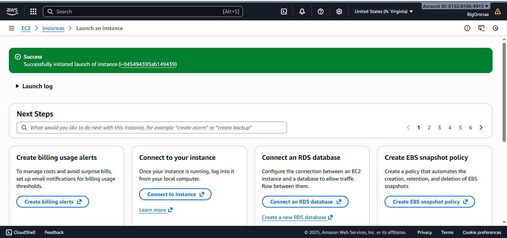
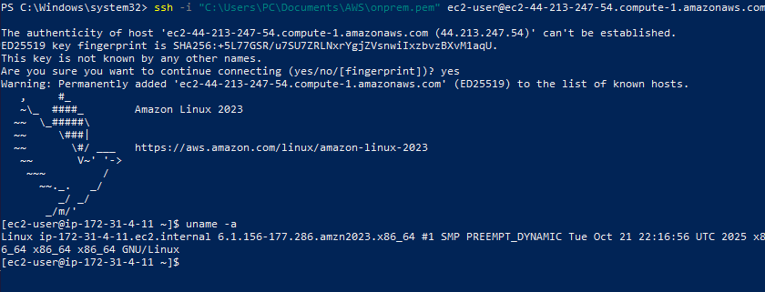
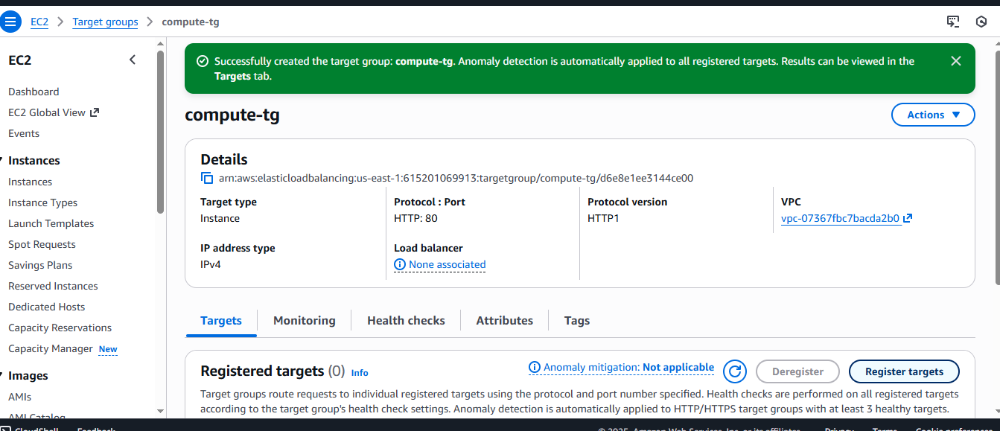
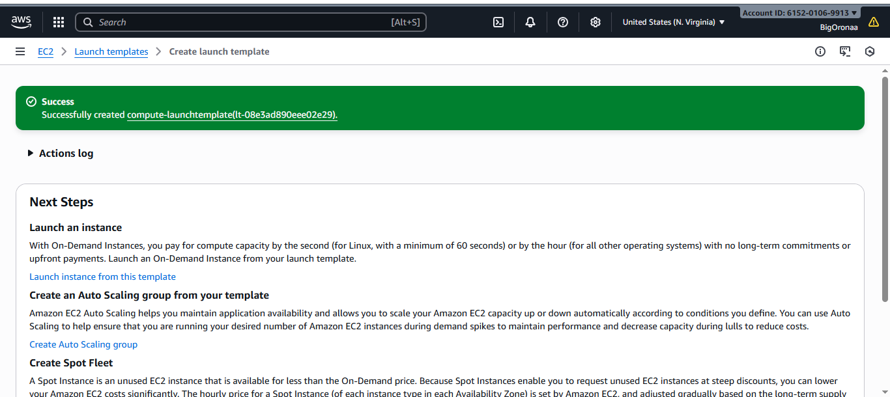
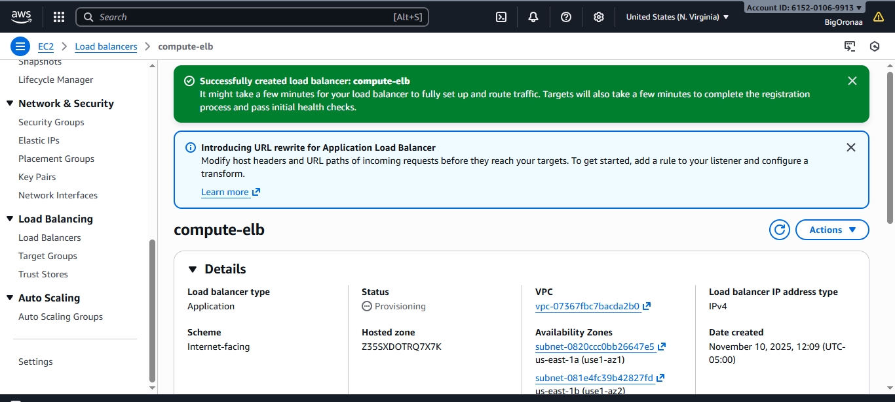
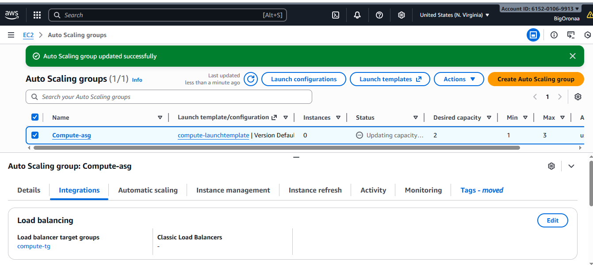
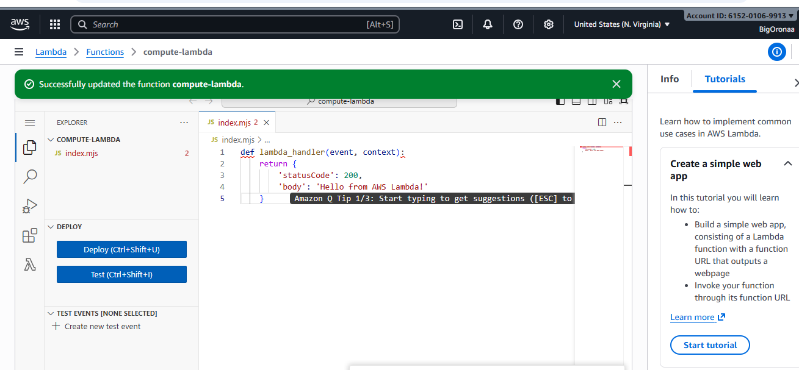
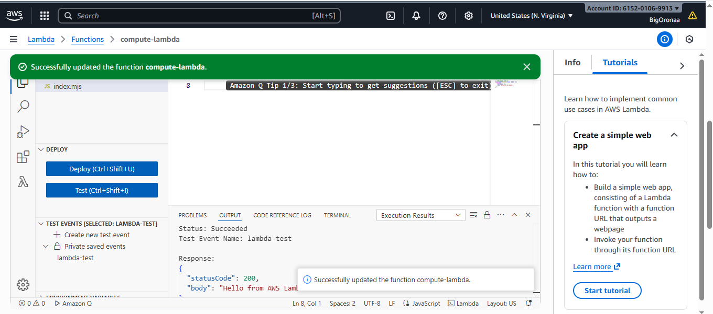
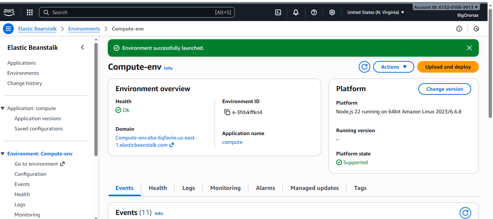
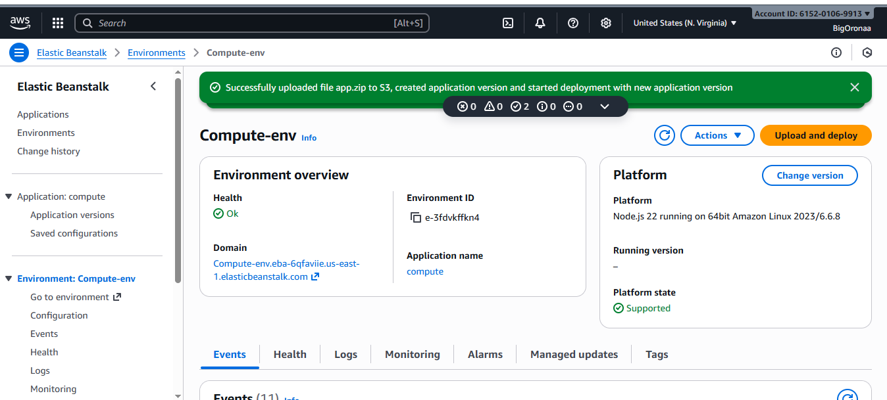

#  AWS Compute Hands-On Project


**Objective:**  
In this project, I explored various AWS compute services to deploy and manage cloud applications effectively. The goal was to gain practical hands-on experience with **EC2**, **Auto Scaling**, **Elastic Load Balancing**, **Lambda**, and **Elastic Beanstalk**.

---

##  Step 1: Launch an EC2 Instance

1. I navigated to the **EC2** service in the AWS Management Console.  
2. I clicked **Launch Instance** and selected an **Amazon Machine Image (AMI)** — specifically **Amazon Linux 2**.  
3. I chose the **t2.micro** instance type (free tier eligible).  
4. I configured a **Key Pair** to enable SSH access.  
5. In the **Security Group**, I allowed the following ports:
   - SSH (22) for remote access  
   - HTTP (80) for web traffic  
6. Finally, I clicked **Launch Instance** and waited for the EC2 instance to start successfully.

---

### I added Screenshots



##  Step 2: Connect to the EC2 Instance

Once the instance was running, I connected to it using SSH from my terminal:

```bash
ssh -i your-key.pem ec2-user@your-ec2-public-ip
```

To verify the connection and check the operating system, I ran:

```bash
uname -a
```

This confirmed that I had connected successfully to the EC2 instance.

---

### I added Screenshots



##  Step 3: Create an Auto Scaling Group with Load Balancer

1. I navigated to **EC2 → Auto Scaling Groups**.  
2. I clicked **Create Auto Scaling Group** and selected an existing launch template.  
3. I configured scaling policies to automatically add instances when CPU usage exceeded **70%**.  
4. Next, I went to **Elastic Load Balancing** and created a **Load Balancer** to distribute traffic across instances.  
5. Finally, I attached the **Auto Scaling Group** to the Load Balancer to ensure high availability and fault tolerance.

---

### I added Screenshots






##  Step 4: Deploy a Serverless AWS Lambda Function

1. I opened the **AWS Lambda** service in the Console.  
2. I clicked **Create Function → Author from Scratch**.  
3. I set a function name and chose **Node.js** as the runtime environment.  
4. I entered the following sample code:

```python
def lambda_handler(event, context):
    return {
        'statusCode': 200,
        'body': 'Hello from AWS Lambda!'
    }
```

5. I clicked **Deploy**, then ran a **Test** event to verify that the function executed successfully.  
6. The output returned:  
   ✅ **"Hello from AWS Lambda!"**

---

### I added Screenshots





## 🌱 Step 5: Deploy an Application Using AWS Elastic Beanstalk

1. I navigated to **AWS Elastic Beanstalk**.  
2. I created a new application and named it appropriately.  
3. I selected **Node.js** as the platform.  
4. I uploaded my application ZIP file containing the app source code.  
5. I clicked **Create Environment** and waited for AWS to automatically provision the necessary infrastructure.  
6. Once deployment completed, I accessed the application via the Beanstalk-generated domain URL.

---

### I added Screenshots



---

##  Project Outcome

Through this project, I successfully deployed and managed multiple AWS compute services.  
I learned how to:
- Launch and connect to EC2 instances  
- Set up Auto Scaling and Load Balancing for high availability  
- Deploy a serverless Lambda function  
- Host a web application on Elastic Beanstalk  


