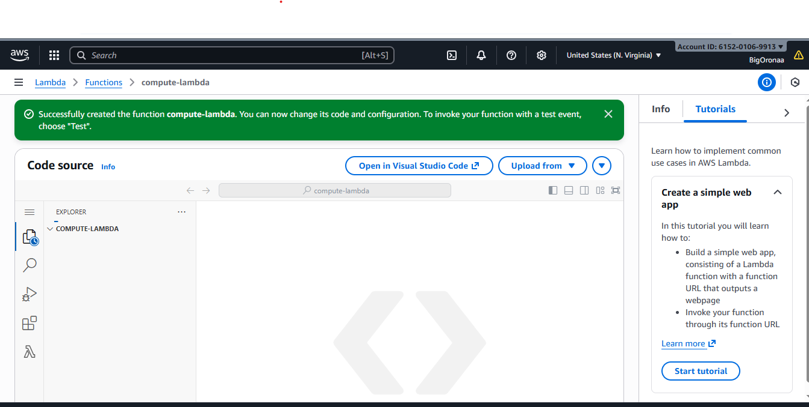
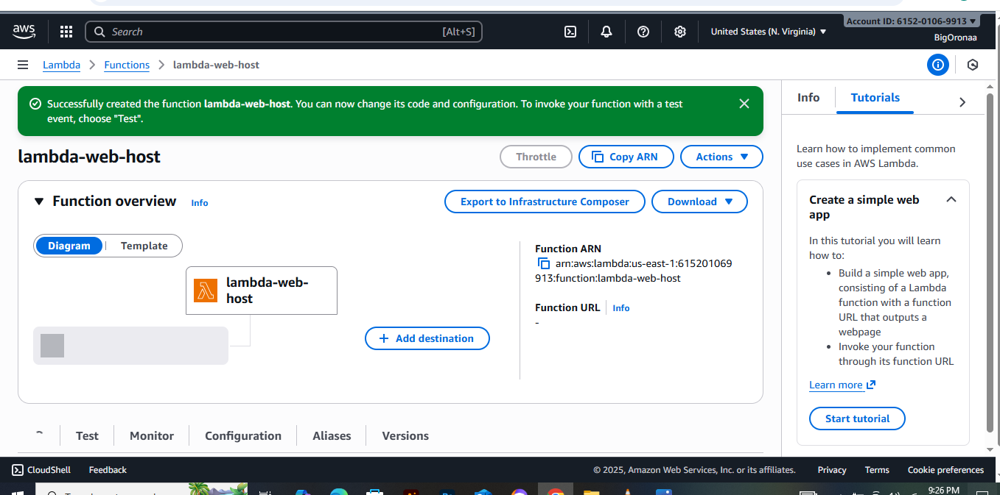
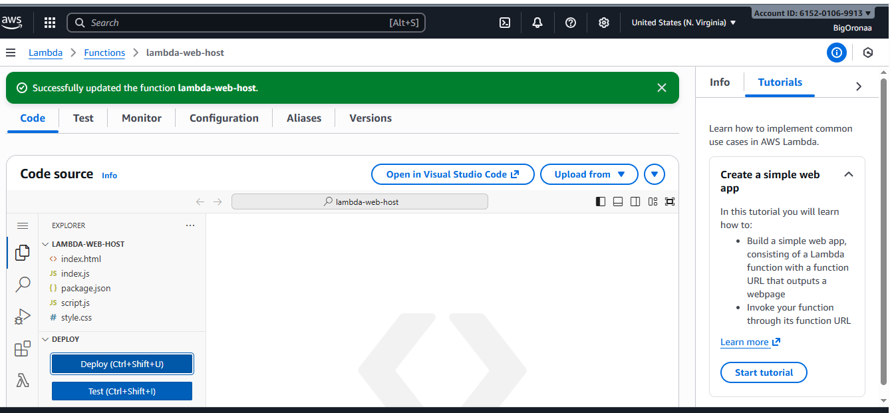
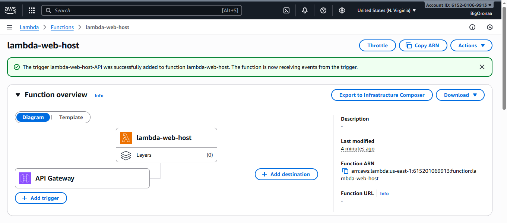
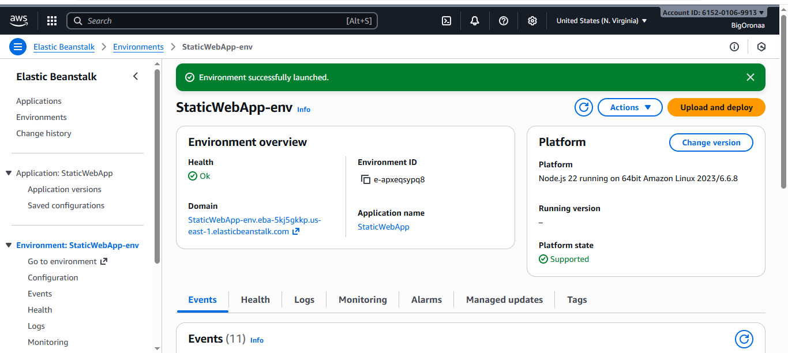
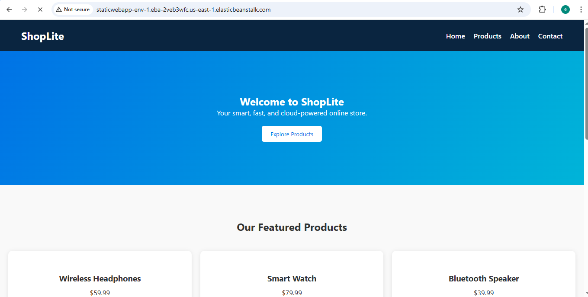
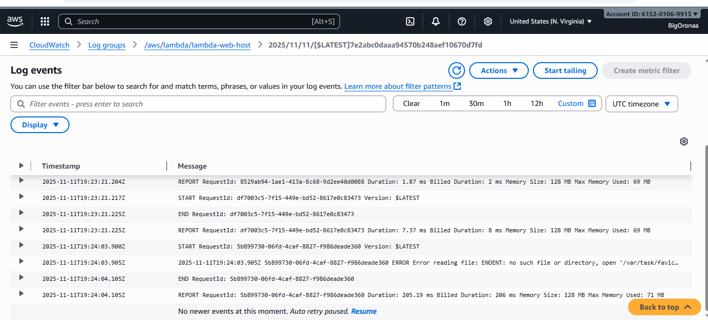
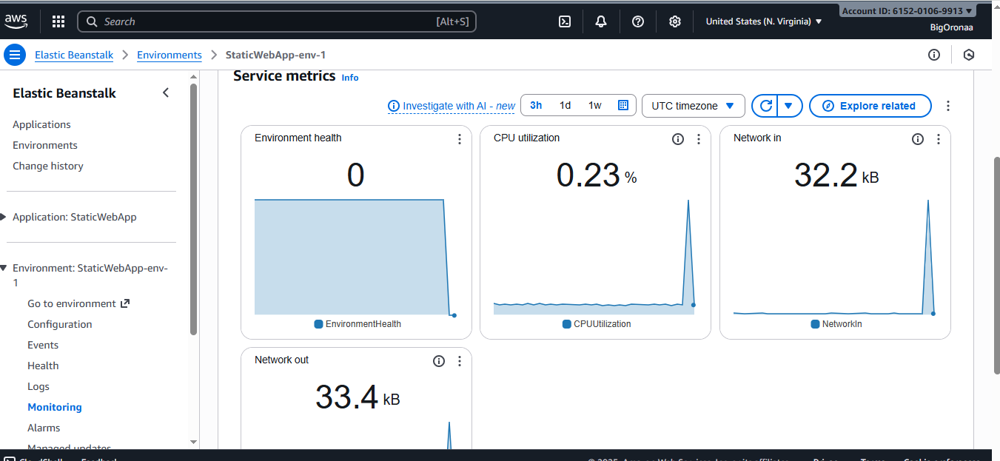

# AWS Critical Thinking Project – Web Deployment Analysis

## Project Overview
In this project, I was tasked with modernizing the infrastructure for a small e-commerce startup. The company wanted to move from a traditional web server to a more efficient, scalable, and cost-effective cloud solution. My role as a DevOps Engineer was to evaluate **AWS Lambda** and **Elastic Beanstalk** as potential hosting options for the company’s website.

---

## Steps I Completed

### 1. Website Setup
I began by obtaining a simple static website template that included **HTML**, **CSS**, and **JavaScript** files to simulate a real-world e-commerce application. The website was named **ShopLite**, representing a smart, fast, and cloud-powered online store.

### I added Screenshots

### 2. Deploying on AWS Lambda
I deployed the static website using **AWS Lambda** through a Node.js-based handler. This required setting up the `index.js` (handler) and `package.json` files with the required dependencies. I packaged the site and dependencies into a ZIP and uploaded it to Lambda, then exposed it via API Gateway / Function URL. Testing confirmed the site loads and serves static content successfully.

### I added Screenshots

### 3. Deploying on AWS Elastic Beanstalk
Next, I packaged the same website and deployed it on **AWS Elastic Beanstalk** using a Node.js environment. I uploaded the application zip containing `server.js` (or `index.js`), `package.json`, `node_modules/`, and the `public/` static content. I resolved an initial deployment issue by ensuring a proper entry point (`server.js` or `Procfile`). The environment deployed successfully and served the same site.

---

### I added Screenshots

---

## Monitoring and Performance Analysis

### AWS Lambda Performance (CloudWatch Logs)
From **CloudWatch Logs**, I observed that:
- The **execution duration** per request ranged between **~15 ms and ~200 ms**.
- **Memory usage** was around **69–71 MB** of the 128 MB allocated.
- **Cold start time** was approximately **150 ms** for idle function starts; warm invocations were sub-10 ms in many cases.
- A minor error appeared for a missing `favicon.ico` file (ENOENT) — not affecting page functionality.

**Conclusion:** Lambda performed exceptionally well for static requests with minimal latency and behaved efficiently under light testing conditions.

### I added Screenshots

### AWS Elastic Beanstalk Performance (Monitoring Dashboard)
From the **Elastic Beanstalk monitoring metrics**, I observed:
- **CPU utilization:** ~0.23%
- **Network in:** ~32.2 KB
- **Network out:** ~33.4 KB
- **Environment health:** Healthy / OK

**Conclusion:** Elastic Beanstalk provided stable, consistent performance with very low resource utilization for the static site. Response times are steady when the instance is warm; scaling out requires launching EC2 instances, which is slower than Lambda's instant scaling.

### I added Screenshots

---

## Performance and Scalability Comparison

| Feature | AWS Lambda | AWS Elastic Beanstalk |
|--------|-----------:|----------------------:|
| Startup (cold) | ~150 ms | Instant (instance always on) |
| Warm response | 1–15 ms | ~100–300 ms (depends) |
| Scalability | Automatic per request | Auto-scaling groups (1–2 min to scale) |
| Resource usage | Low; managed by AWS | Depends on EC2 instance size |
| Maintenance | Minimal | OS/instance level maintenance possible |
| Best fit | Bursty / low traffic, prototypes | Steady traffic, full-stack apps |

---

## Cost Analysis

| Service | Pricing Model | Estimated Monthly Cost (Light Usage) |
|--------|----------------|--------------------------------------:|
| AWS Lambda + API Gateway | Pay per request + compute time | **~$0–$3** (depends on traffic and payloads) |
| Elastic Beanstalk (t2.micro) | EC2 hourly + LB/storage | **~$8–$15** (minimum instance costs) |

**Key cost takeaways:**
- Lambda is highly cost-efficient for low-to-moderate traffic and precise billing by compute time.  
- Elastic Beanstalk cost is dominated by underlying EC2 instances and any load balancer; it’s more predictable for steady traffic but incurs baseline cost even when idle.

---

## Recommendations to Management (Actionable)

Based on my findings, I recommend the following options and next steps. Each recommendation includes the motivation, benefits, and brief implementation notes so management can make an informed choice.

### Recommendation A — Short-term / Cost-Sensitive (Preferred for MVP and Low Traffic)
- **Choose AWS Lambda (serverless) + API Gateway or Lambda Function URL** to host the static frontend (or S3 + CloudFront if you prefer pure static hosting).
- **Why:** Lowest operating cost for sporadic or low traffic. Minimal operations overhead and near-zero maintenance.
- **How:**  
  - Keep the current Lambda function or move static files to **S3** and enable **Static Website Hosting**.  
  - Add **CloudFront** in front of S3 for CDN, caching, HTTPS, and reduced latency.  
  - Use **Route 53** for DNS and SSL via ACM for a friendly domain.
- **Monitoring & Cost Control:** Configure CloudWatch alarms for sudden spikes in invocations & set an AWS budget alert.

### Recommendation B — Mid-term / Predictable Traffic
- **Choose Elastic Beanstalk** for a managed environment running Node.js (or containerized) if the application requires server-side logic, sessions, or persistent processes.
- **Why:** Easier to support full-stack or stateful components; more control over runtime and environment.
- **How:**  
  - Use **auto-scaling** groups with sensible min/max instance counts (e.g., min=1, max=3 initially).  
  - Use **load balancer** health checks and CloudWatch to auto-scale on CPU or request count.  
  - Implement cost optimization: use spot instances for non-critical workers or scheduled scaling to stop instances during low hours if traffic is predictable.
- **Monitoring & Cost Control:** Enable detailed CloudWatch metrics and set scaling policies; tag resources for cost reporting.

### Recommendation C — Hybrid / Best-of-Both (Scalable + Cost-Optimized)
- **Combine S3 + CloudFront for static assets** (HTML/CSS/JS) and **Lambda** for API or serverless functions, while Elastic Beanstalk or ECS handles heavier background tasks or legacy services.
- **Why:** This architecture gives best performance (CDN for static), low cost (serverless for APIs), and control (managed compute for heavy services).
- **How:**  
  - Move static content to S3, front with CloudFront.  
  - Keep API endpoints as Lambda functions (or Lambda behind ALB if needed for VPC access).  
  - Migrate any legacy background processing to ECS/EKS or Beanstalk worker tiers.
- **Monitoring & Cost Control:** Use centralized logging (CloudWatch Logs + Insights) and consolidate cost monitoring in Cost Explorer and Budgets.

### Security and Operational Recommendations (All Options)
- Enforce least-privilege IAM roles for Lambda and EB instances.  
- Use AWS WAF and security groups to block malicious traffic.  
- Enable AWS Shield Standard (default) and consider Shield Advanced if DDoS risk is high.  
- Enable VPC endpoints and restrict S3 buckets (if used) with proper bucket policies.  
- Use automated backups or replication for any persistent data stores.

### Migration and Rollout Plan (Suggested)
1. **Short experiment:** Keep current Lambda deployment and set up S3+CloudFront as pilot. Measure performance and costs for 1–2 weeks.  
2. **Decision point:** If traffic grows or requires server-side logic, deploy an Elastic Beanstalk environment or containerized service and route APIs accordingly.  
3. **Production rollout:** Move DNS to Route 53 with staged cutover and rollback plan; use Blue/Green or Canary deployments for EB.

---

## Summary of Key Metrics (Recorded)
| Metric | Lambda | Elastic Beanstalk |
|--------|--------:|------------------:|
| Average Latency | ~15–200 ms | ~100–300 ms |
| CPU Utilization | N/A (event-based) | ~0.23% (observed) |
| Memory Used | ~69 MB | ~512+ MB (instance) |
| Cost (Light Traffic) | <$1/month | ~$8–15/month |
| Scalability | Excellent (instant) | Good (delayed due to instance startup) |
| Setup Complexity | Moderate | Easy via EB Console |

---

