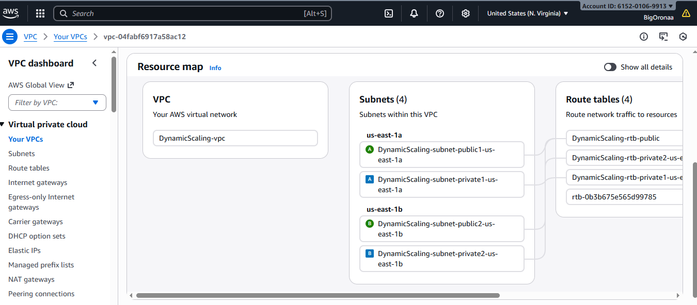
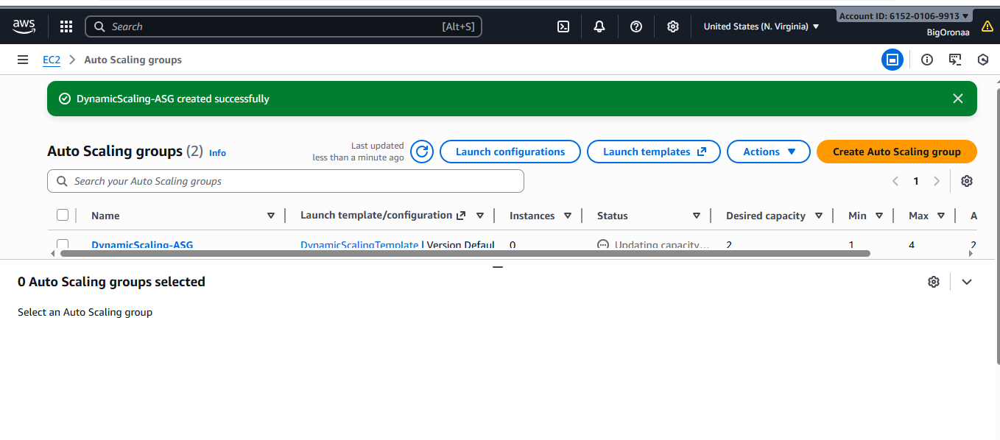
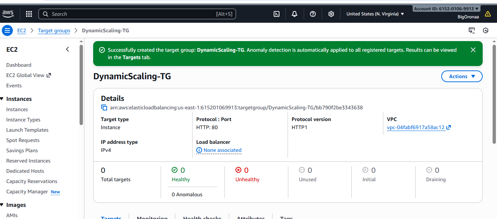
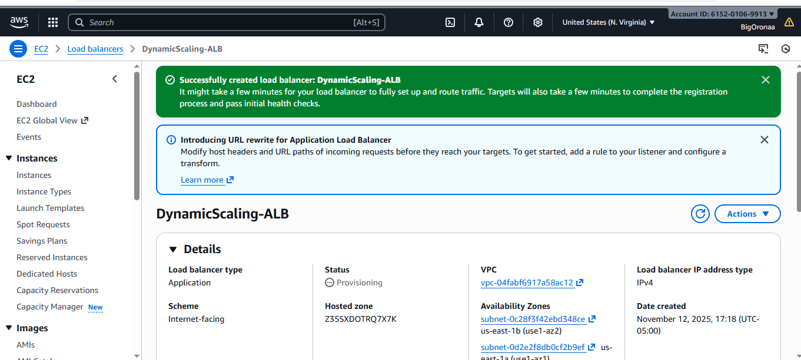
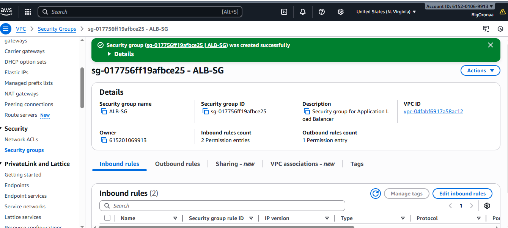
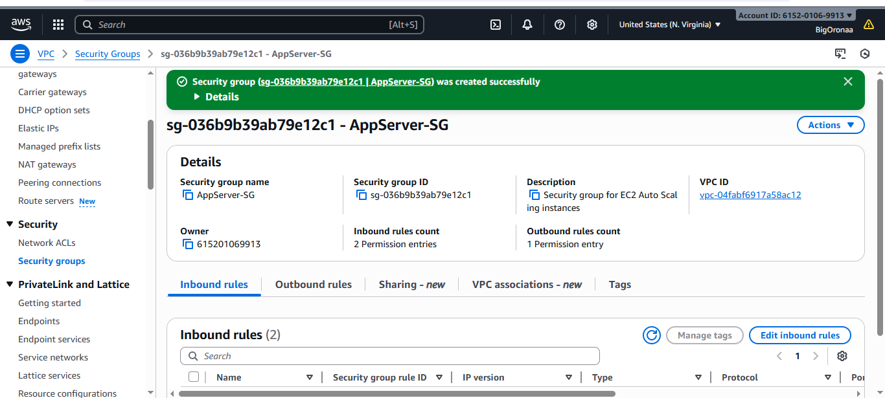
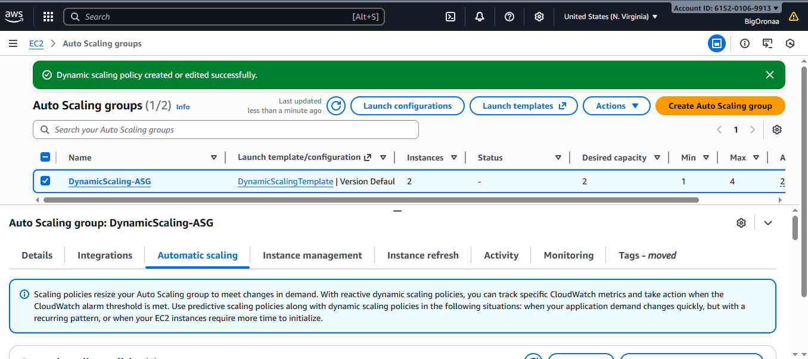
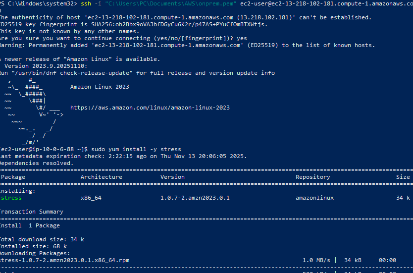
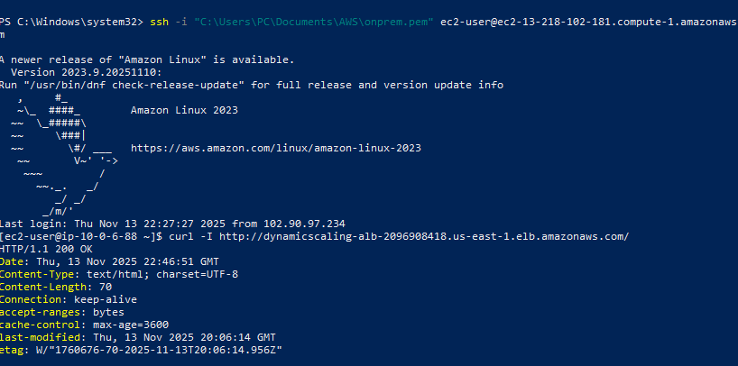

# Dynamic Scaling in AWS Auto Scaling 


##  Project Overview

The objective of this project was to implement **dynamic scaling** for a sample e-commerce application using **AWS Auto Scaling** and **Application Load Balancer (ALB)**. This ensures that the application maintains optimal performance during traffic spikes while controlling costs during low traffic periods.

I created the infrastructure in **a single AWS region across multiple Availability Zones** to demonstrate high availability and scalability.

---

##  Architecture Diagram

### I added Image


##  Implementation Steps

###  VPC and Networking
- I created a **VPC** named `DynamicScaling-vpc` with **CIDR 10.0.0.0/16**.
- I created **subnets across multiple Availability Zones** to ensure redundancy.
- I attached an **Internet Gateway** to allow public traffic.


### I added Image



###  Launch Template
- I created a **launch template** named `DynamicScalingTemplate` using **Amazon Linux 2023 AMI**.
- I selected **t3.micro** as the instance type and attached the security group `AppServer-SG`.
- I enabled **HTTP access on port 80** for the instances.


### I added Image


###  Auto Scaling Group (ASG)
- I created an **ASG named `DynamicScaling-ASG`** with:
  - Minimum: 1 instance  
  - Desired: 1 instance  
  - Maximum: 3 instances
- I attached it to the launch template and selected multiple subnets for high availability.


### I added Image



### Target Group & Application Load Balancer (ALB)
- I created a **Target Group** named `DynamicScaling-TG` using **HTTP on port 80**.
- I registered the instances with the target group.
- I created an **Internet-facing ALB** named `DynamicScaling-ALB` and linked it to the target group.
- Health checks were configured to ensure only healthy instances receive traffic.


### I added Image






###  Dynamic Scaling Policy
- I defined a **Target Tracking Scaling Policy** based on **Average CPU Utilization**.
- I set the **CPU threshold to 80%** to trigger scale-out.
- The ASG scaled in automatically when CPU dropped below threshold.


### I added Image



###  Testing / Stress Simulation
- I connected to an instance via SSH using my key pair `onprem.pem`.
- I installed the **stress tool** and ran:

```bash
stress --cpu 2 --timeout 300
```

- I observed the **ASG automatically launch new instances** as CPU usage increased.
- Refreshing the **ALB URL** showed requests served by multiple instances over time.

---

### I added Image




---

## Conclusion

I successfully implemented a **dynamic scaling solution** using AWS Auto Scaling and ALB:

- Instances scaled out when CPU usage exceeded 80%  
- Instances scaled in automatically when load decreased  
- ALB distributed traffic to multiple instances, demonstrating high availability  
- The infrastructure was built across multiple Availability Zones within a single region  

---