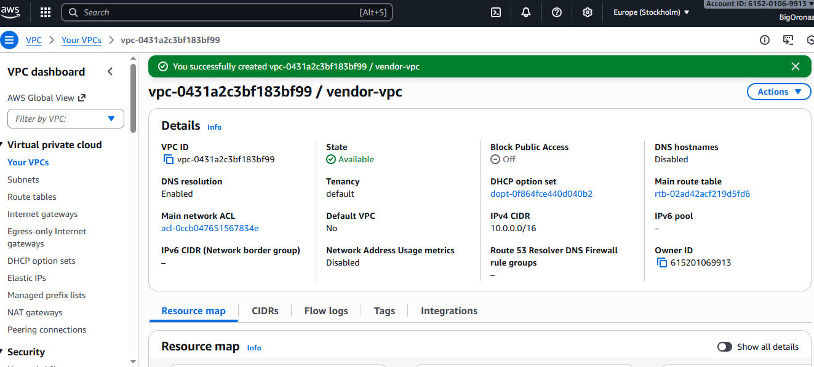
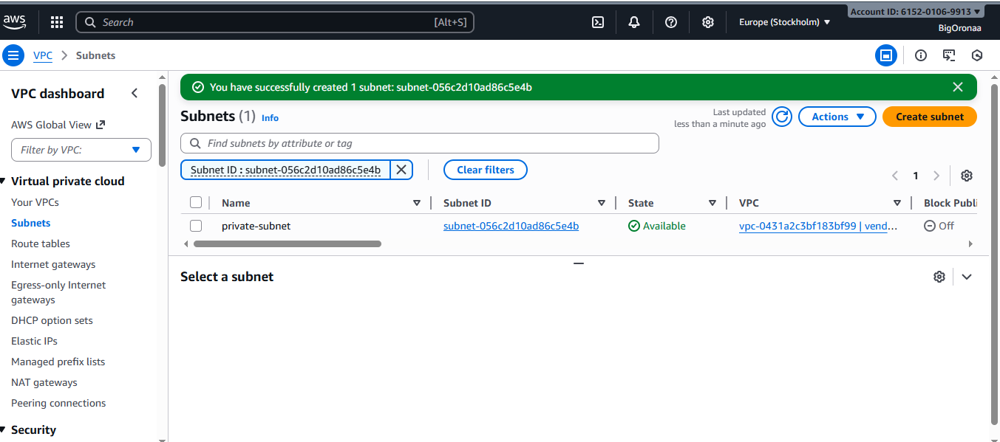
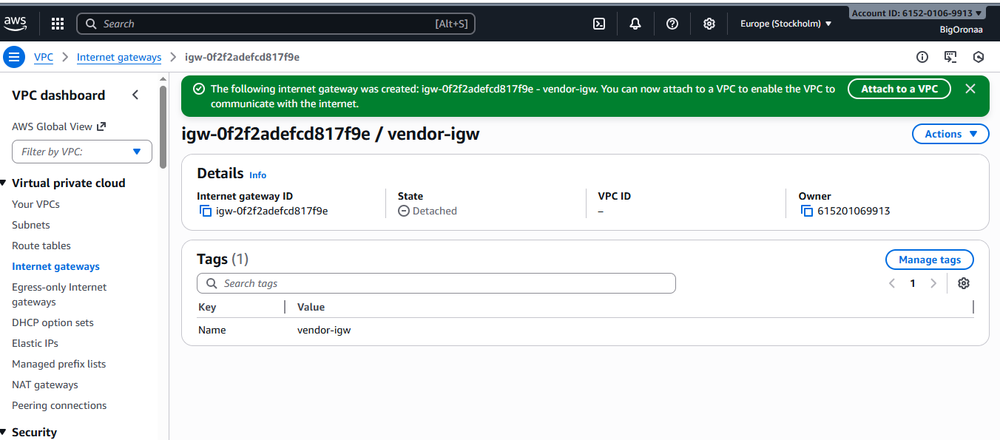
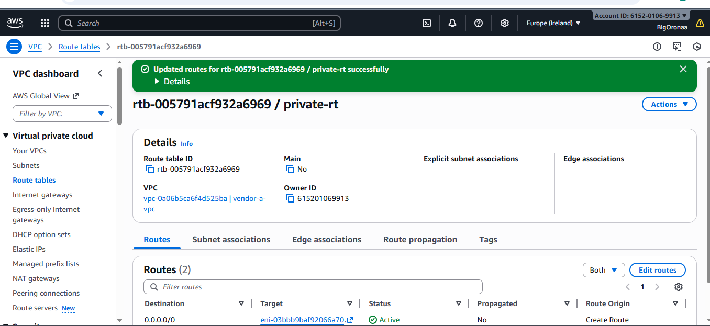
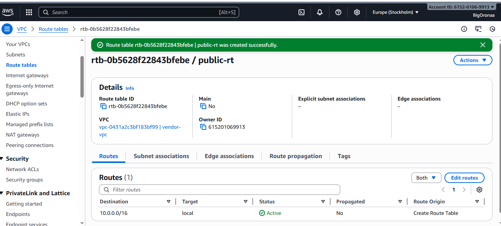
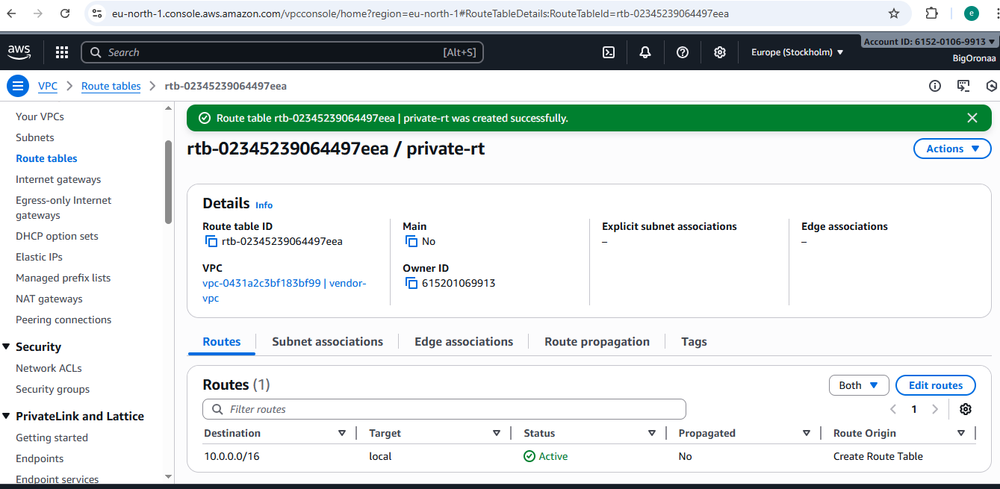
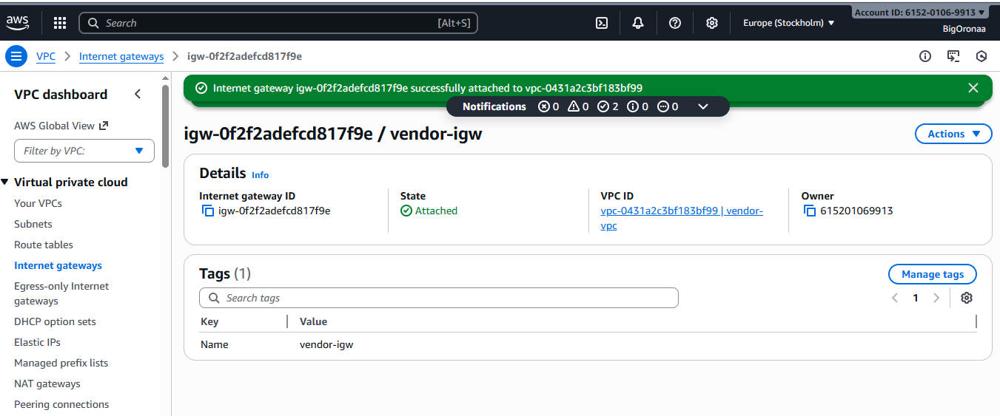
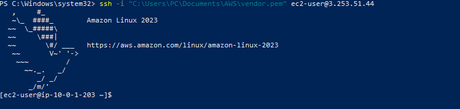

# AWS Critical Thinking Projects — Hands-on Lab Report


---

##  Executive summary

I designed and implemented an AWS lab environment to demonstrate how a private application can reach Vendor A over a secure AWS Site‑to‑Site VPN and appear to originate from a single, pre‑approved private IP. I built the VPC, public and private subnets, launched EC2 instances to act as NAT / bastion and application servers, attached an Internet Gateway, created route tables, and created the AWS side of the VPN (Customer Gateway, Virtual Private Gateway, VPN Connection). I configured a NAT EC2 to perform IP forwarding and SNAT so all egress from the private subnet uses one private IP.

---

## Step‑by‑step actions I performed

> I include the exact console actions and terminal commands I ran. 

### Step 1 — VPC and Subnets
- In the AWS Console I created `vendor-a-vpc` (CIDR `10.0.0.0/16`).
- I created two subnets:
  - `public-subnet` (Availability Zone eu-west-1a, e.g. `10.0.1.0/24`)
  - `private-subnet` (Availability Zone eu-west-1b, e.g. `10.0.2.0/24`)

### I added Screenshots




---

### Step 2 — Internet Gateway and Route Tables
- I created and attached an Internet Gateway (`vendor-igw`) to the VPC.
- I created `public-rt` and added route `0.0.0.0/0 → vendor-igw`. I associated `public-subnet` with `public-rt`.
- I created `private-rt` and associated it with `private-subnet` (initially no NAT target until I created the NAT instance).

### I added Screenshots






---

### Step 3 — Launch NAT EC2 (Bastion) in public-subnet
- AMI: Amazon Linux 2023 (t2.micro to avoid vCPU limit errors)
- Key pair used: `vendor.pem` (local path I used: `C:/Users/PC/Documents/AWS/vendor.pem`)
- Network: VPC `vendor-a-vpc`, Subnet `public-subnet`
- I assigned a fixed private IP (example `10.0.1.203`) and auto‑assign public IPv4 (public = `3.253.51.44`).
- Security group: allowed SSH from my IP and outbound all.

---

### Step 4 — Configure NAT instance (IP forwarding + SNAT)
Inside the NAT instance I ran:

```bash
# enable IP forwarding now
sudo sysctl -w net.ipv4.ip_forward=1

# persist it
echo "net.ipv4.ip_forward = 1" | sudo tee -a /etc/sysctl.conf
sudo sysctl -p

# install iptables if needed (Amazon Linux 2023 may require dnf/yum)
sudo dnf install -y iptables || sudo yum install -y iptables

# SNAT: make outgoing packets use the NAT instance private IP
sudo iptables -t nat -A POSTROUTING -o ens5 -j SNAT --to-source 10.0.1.203

# verify rule
sudo iptables -t nat -L -n -v
```

---

### I added Screenshots



---


### Step 5 — Update private route table to use NAT instance
- In the VPC console I edited the `private-rt` to add:
  - Destination: `0.0.0.0/0`
  - Target: NAT instance (example: `i-0abcdef...`)

This routed private subnet egress through the NAT instance.


---

### Step 6 — Verify NAT forwarding works (connectivity test)
From a private instance I tested outbound connectivity. Example test run:
```bash
# from private app instance
ping -c 5 8.8.8.8
# observed continuous replies (sample lines from lab):
# 64 bytes from 8.8.8.8: icmp_seq=1539 ttl=117 time=1.40 ms
```

This confirmed that outbound traffic flows through the NAT instance.

---

### Step 8 — Create AWS Site‑to‑Site VPN (AWS side)
I created in the VPC console:
- Customer Gateway (`cgw-01bbe6728e73781bb`) — used placeholder public IP `1.2.3.4` for the lab.
- Virtual Private Gateway (`vgw-010b60c7df67207ad`) and attached it to the VPC.
- VPN Connection `vpn-059785470647a8036` (AWS generated two tunnels).

I downloaded the VPN configuration file (AWS produced a vendor-specific config). The config included:
- Tunnel outside IPs: `34.253.5.41` and `52.30.208.243`
- Inside address ranges: `169.254.62.112/30` and `169.254.239.236/30`
- AWS‑side config instructions and pre-shared keys (PSKs).

---


