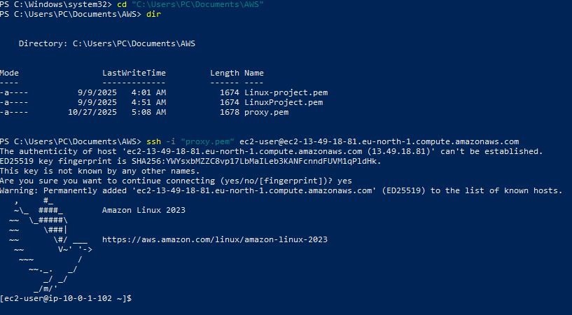
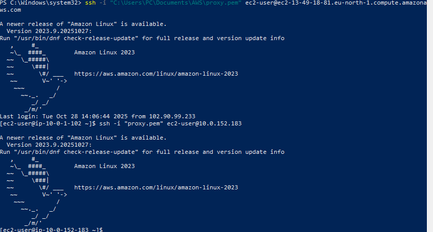
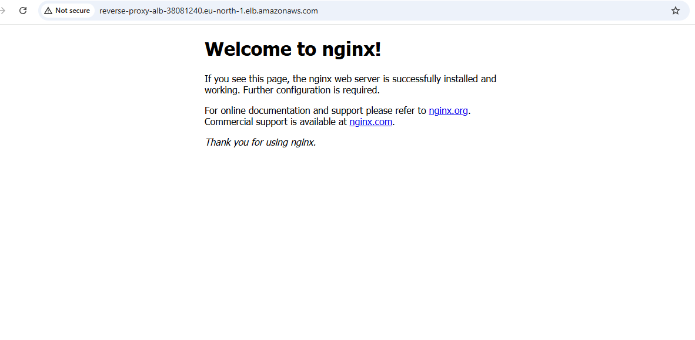
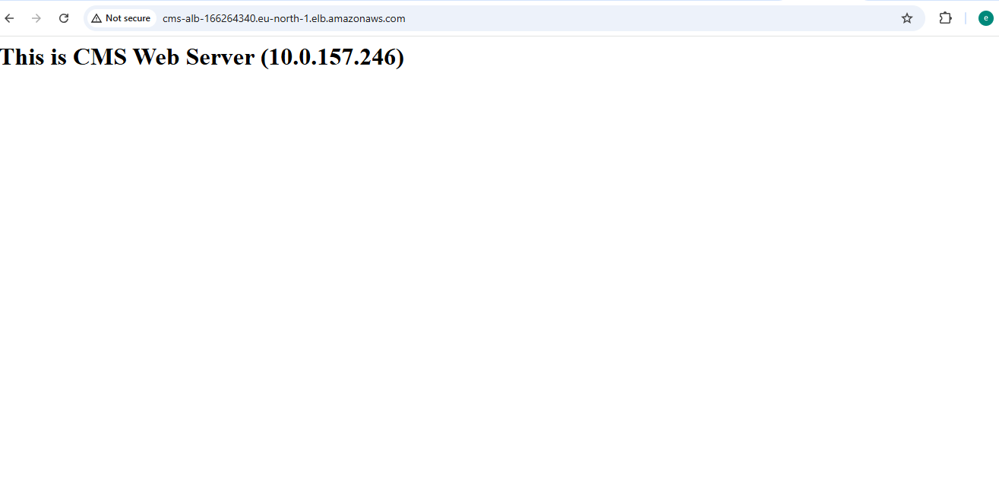
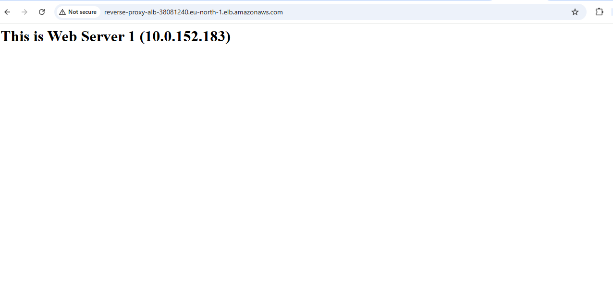
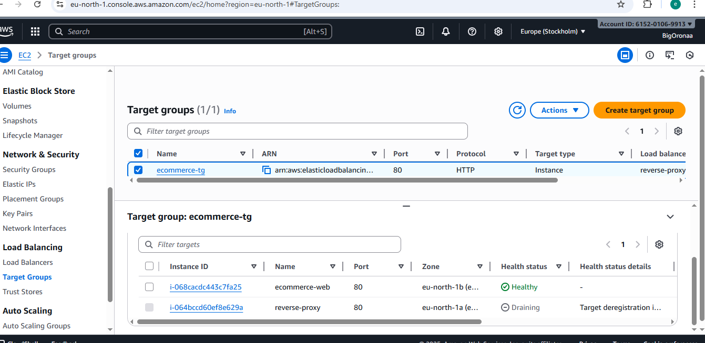
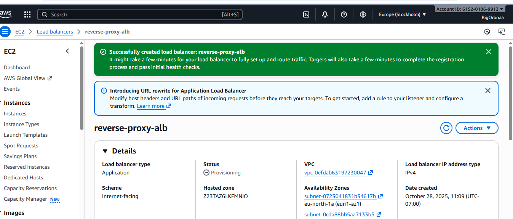
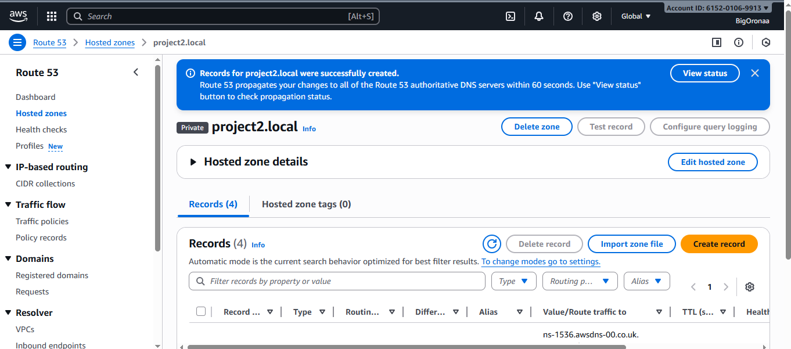

# AWS Critical Thinking Projects

## Project Overview

This project involved building and configuring a **multi-tier web
application architecture** on AWS. The goal was to simulate a
production-like environment using **EC2 instances, ALBs (Application
Load Balancers), Target Groups, and Route 53**, while practicing key
DevOps and cloud administration concepts.

------------------------------------------------------------------------

##  Objectives

-   Deploy multiple EC2 instances for **CMS** and **E-Commerce**
    environments.
-   Configure **Application Load Balancers (ALBs)** to distribute
    traffic.
-   Use **Target Groups** to associate instances correctly.
-   Implement **reverse proxy architecture**.
-   Test and monitor instance health.
-   Configure **Route 53** for DNS-level routing.
-   Practice AWS CLI / PowerShell commands for instance management and
    SSH access.

------------------------------------------------------------------------

##  Step-by-Step Implementation

### 1. Setting Up EC2 Instances

-   I Created multiple EC2 instances for both CMS and E-Commerce
    environments.


-   Connected to instances via SSH:

    ``` bash
    ssh -i "project-key.pem" ec2-user@<Public-IP>
    ```
---

### I added screenshots




### 2. Installing Web Servers

Installed and configured Apache on each instance:

``` bash
sudo yum update -y
sudo yum install httpd -y
sudo systemctl enable httpd
sudo systemctl start httpd
```

Customized index pages for identification:

-   CMS servers: "This is CMS Server"
-   Reverse proxy: "This is Web Server 1"
-   E-Commerce servers: "This is E-Commerce Server"

---


### I added Screenshots




### 3. Setting Up Target Groups

-   I Created **cms-tg** for CMS servers.
-   I Created **ecommerce-tg** for E-Commerce servers.
-   I Configured health checks for each group using port 80.

---

### I added Screenshots


### 4. Configuring Application Load Balancers

-   I Created **CMS ALB** and attached it to cms-tg.
-   I Created **Reverse Proxy ALB** and attached it to ecommerce-tg.
-   I Verified listener configurations (port 80) and confirmed healthy
    targets.

---

### I added Screenshots



### 5. Verifying Reverse Proxy

I Accessed the Reverse Proxy instance via public IP.

I Confirmed it displayed:

    This is Web Server 1 (10.0.x.x)

Verified requests were routed correctly to the E-Commerce ALB.


### 6. Route 53 Configuration

-   Created a private hosted zone for internal DNS routing.
-   Added records pointing to both ALBs:
    -   **cms.project2.local → CMS ALB DNS name**
    -   **ecommerce.project2.local → Reverse Proxy ALB DNS name**
-   Verified that DNS queries resolved correctly.

------------------------------------------------------------------------

### I added Screenshots


##  Outcome

-   CMS and E-Commerce web tiers are properly load-balanced.
-   Reverse proxy forwards traffic efficiently to the backend.
-   Route 53 handles domain-level routing for both environments.
-   Infrastructure is resilient, scalable, and demonstrates best
    practices for AWS load balancing and DNS routing.

------------------------------------------------------------------------


