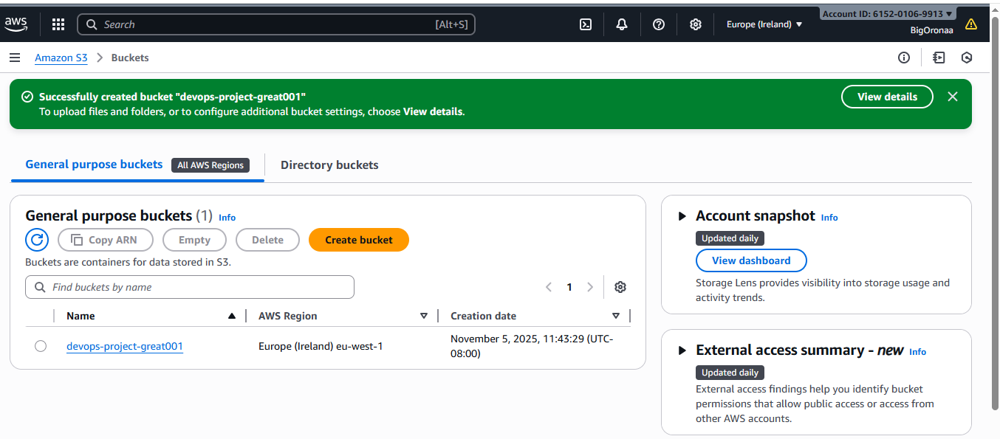
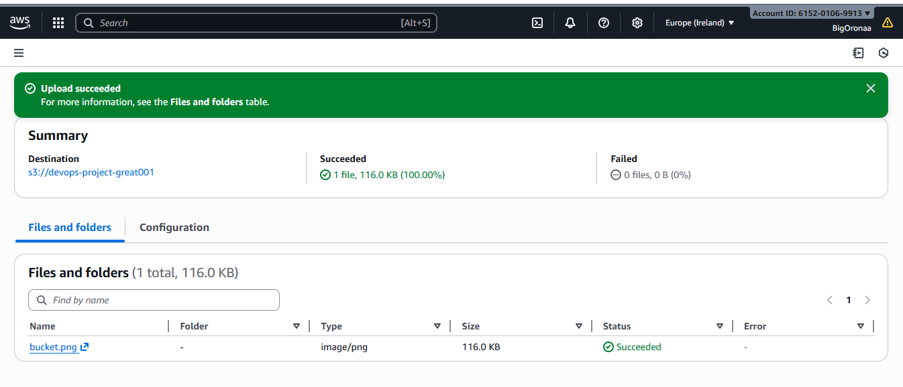
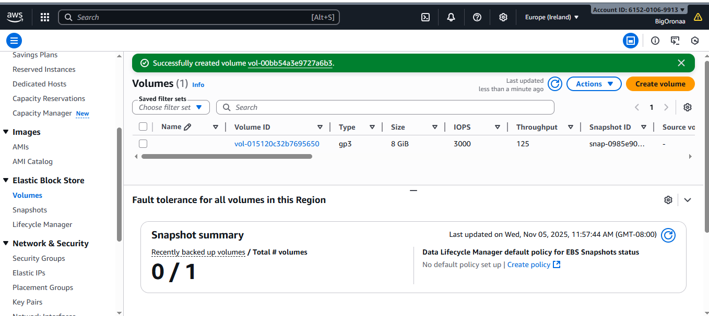
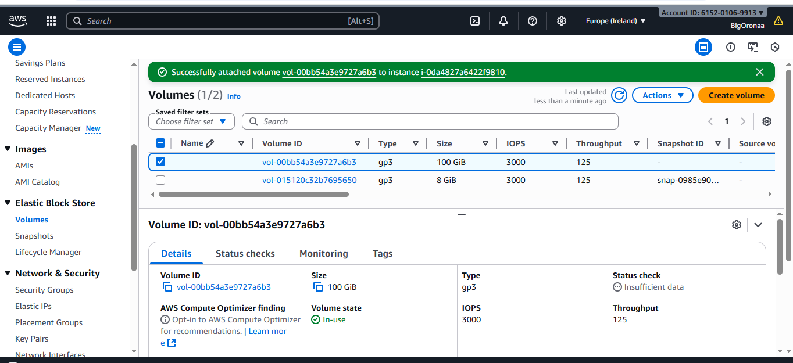
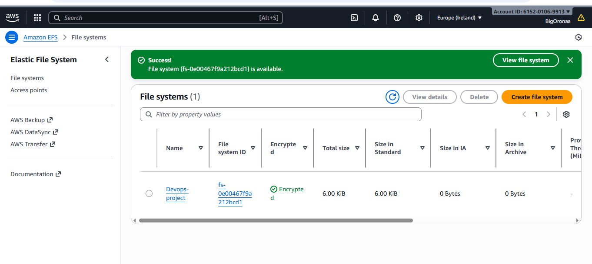
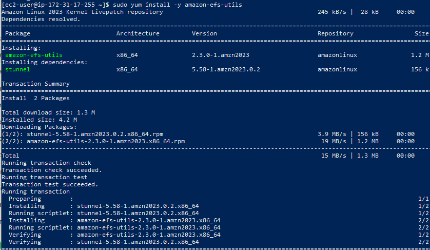
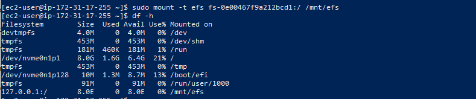
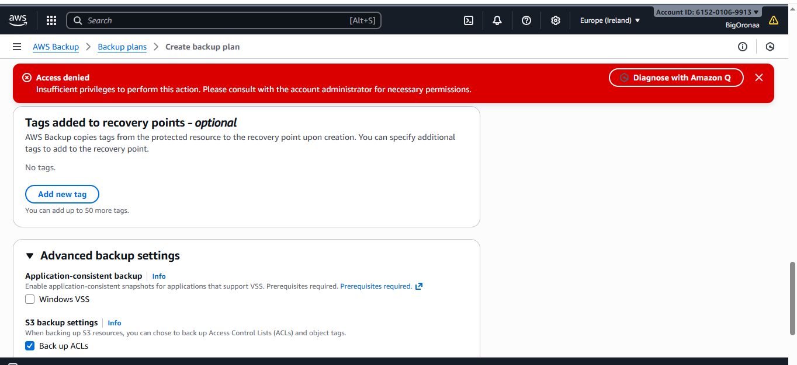
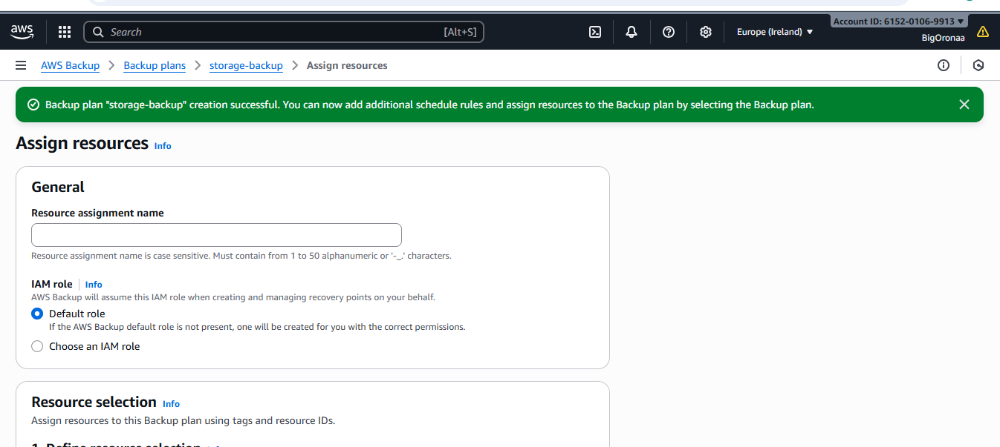
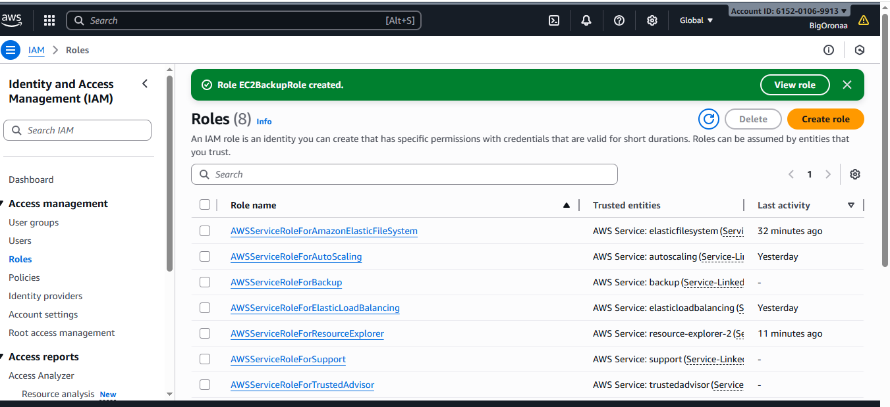

# AWS Storage Hands-On Project

## Objective
I Set up and managed different AWS storage services using the AWS Management Console.
---

## Step 1: Create an Amazon S3 Bucket
- I navigated to the S3 service in the AWS Console.
- I clicked **Create bucket** and provided a unique name.
- I chose a region and enabled **Block Public Access** for security.
- I configured **Versioning** as needed.
- I clicked **Create bucket**.

### I added Screenshots

---

## Step 2: Upload a File to S3
- I opened my newly created bucket.
- I clicked **Upload** and selected a file.
- I configured permissions (private or public) as required.
- I clicked **Upload** to store the file.

### I added Screenshots

---

## Step 3: Create an EBS Volume and Attach to an EC2 Instance
- I navigated to **EC2 > Elastic Block Store (EBS)**.
- I clicked **Create Volume**, selected a size (10GB), and chose a type (GP3).
- I ensured the volume was in the same Availability Zone as my EC2 instance.
- I clicked **Create Volume**.
- I attached the volume to an EC2 instance by selecting the volume, clicking **Attach Volume**, and choosing the instance.

### I added Screenshots

---

## Step 4: Create an Amazon EFS File System
- I navigated to **EFS** in the AWS Console.
- I clicked **Create File System** and selected a VPC.
- I configured performance mode and enabled encryption.
- I clicked **Create** and attached it to my EC2 instance using the provided mount instructions.

### I added Screenshots

---

## Step 5: Set Up AWS Backup
- I navigated to **AWS Backup** in the AWS Console.
- I clicked **Create Backup Plan** and chose **Build a new plan**.
- I set up a backup rule for S3, EBS, or RDS.
- I selected the backup frequency and retention period.
- I clicked **Create Plan**.

### Note on Access Denied Issue
- While attempting to create a backup vault from my EC2 instance using the CLI, I encountered an **AccessDeniedException** due to insufficient privileges for backup storage and KMS.
- To fix this, I leveraged my **EC2BackupRole IAM role** by attaching the necessary backup and KMS permissions to it.
- This allowed me to create backup plans, select resources, and start backup jobs directly from the EC2 instance without requiring root credentials.

---

### I added Screenshots

