# AWS Storage Hands-On Project

**Scenario One**

## Objective
I set up and managed different AWS storage services using the AWS Management Console, ensuring end-to-end configuration and troubleshooting. This included creating S3 buckets, enabling cross-region replication, setting up lifecycle rules, managing permissions, and implementing CloudFront with Route 53 for latency-based global routing.

---

## Step 1: Create an Amazon S3 Bucket (India)
- I navigated to the **S3 service** in the AWS Management Console.
- Clicked **Create bucket** and entered the bucket name: `myapp-india`.
- Selected **Asia Pacific (Mumbai)** as the region.
- Left all defaults except enabling **Bucket Versioning** under “Bucket Versioning”.  
- Clicked **Create bucket** to finish setup.

**Verification:**
- My bucket `myapp-india` appeared in the list successfully.

---

### I added Screenshots
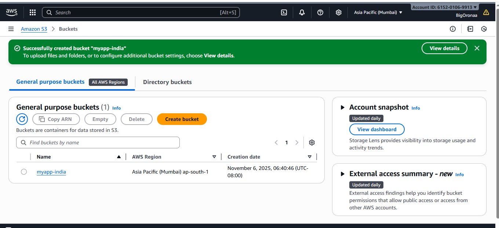


## Step 2: Upload Files and Configure Static Website Hosting
- I opened `myapp-india`, clicked **Properties**, and enabled **Static website hosting**.
- Selected “Host a static website” and set:
  - **Index document:** `index.html`
  - **Error document:** `error.html`
- I uploaded both `index.html` and `error.html` to the bucket.

**Error Encountered:**  
Initially, access was denied when trying to view the file in the browser. I resolved it by editing the **Bucket Policy** to allow public read access using this policy:

```json
{
  "Version": "2012-10-17",
  "Statement": [
    {
      "Sid": "PublicReadGetObject",
      "Effect": "Allow",
      "Principal": "*",
      "Action": "s3:GetObject",
      "Resource": "arn:aws:s3:::myapp-india/*"
    }
  ]
}
```

**Verification:**  
- Visiting the S3 endpoint showed my `index.html` page successfully.

---

### I added Screenshots
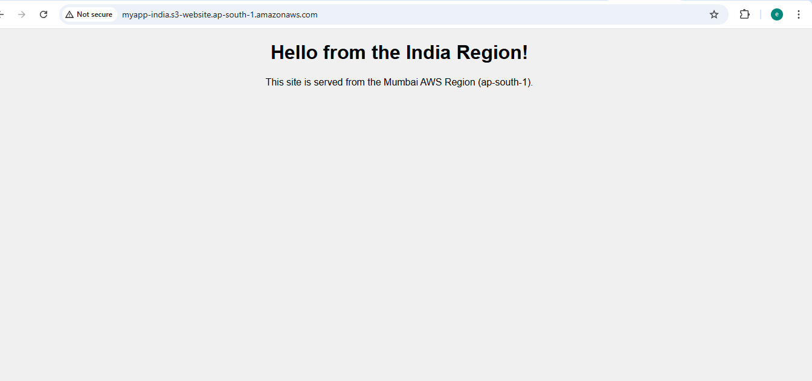

## Step 3: Create a Backup Bucket (london)
- I created a second bucket named `myapp-london` in **Europe (London)**.
- Clicked **Create bucket** and entered the bucket name: `myapp-london`.
- Selected **Asia Pacific (Mumbai)** as the region.
- Left all defaults except enabling **Bucket Versioning** under “Bucket Versioning”.  
- Clicked **Create bucket** to finish setup.

 I opened `myapp-london`, clicked **Properties**, and enabled **Static website hosting**.
- Selected “Host a static website” and set:
  - **Index document:** `index.html`
  - **Error document:** `error.html`
- I uploaded both `index.html` and `error.html` to the bucket.


---

### I added Screenshots
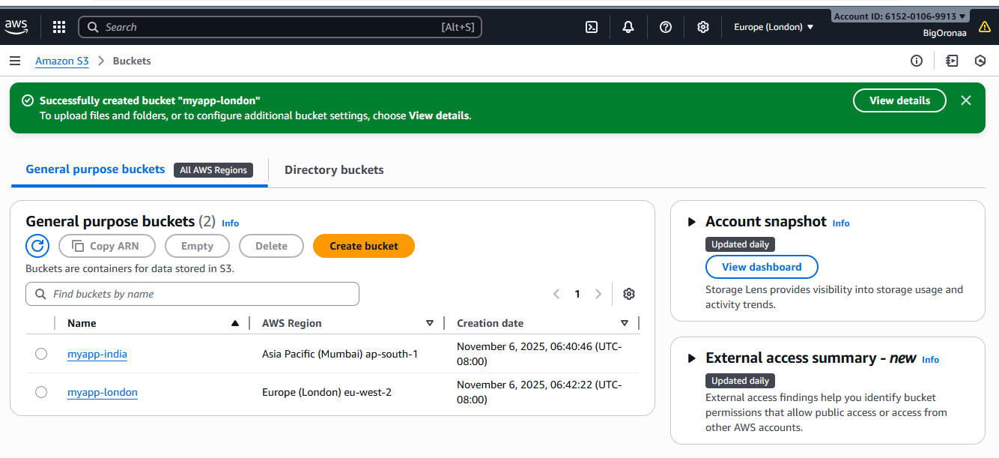
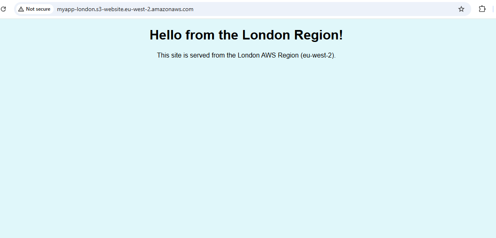
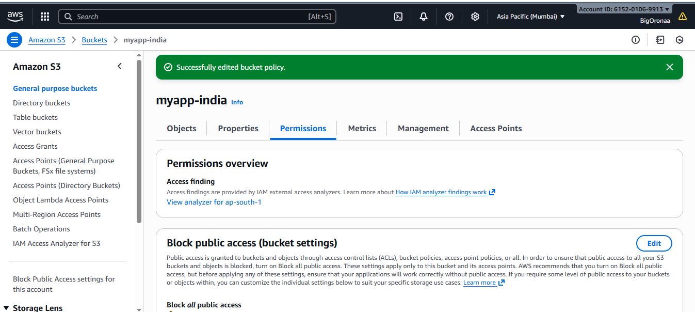

---

## Step 5: Configure Amazon CloudFront Distributions
- I created two CloudFront distributions — one for **India** and another for **London**.
- In the **Origin domain**, I selected each bucket’s **static website endpoint**.
- Set **Default root object:** `index.html`
- Left other settings as default and clicked **Create distribution**.

**Verification:**
- Both distributions were deployed successfully after waiting for the status to change from *In Progress* to *Deployed*.

---

### I added Screenshots
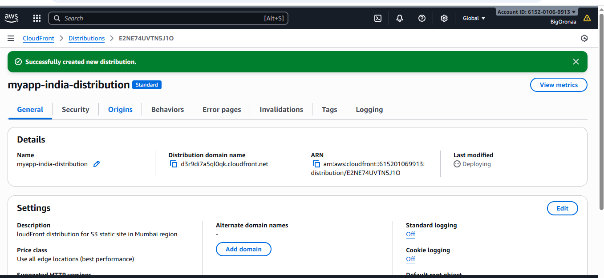
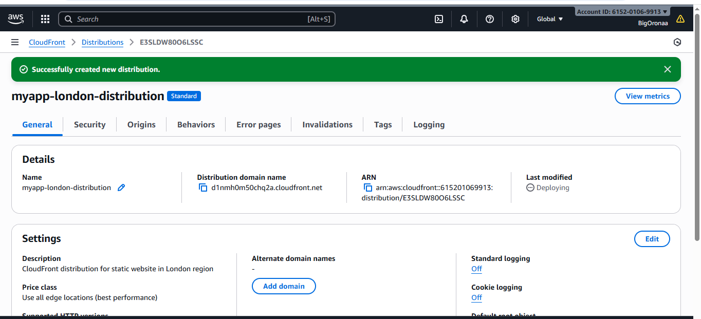
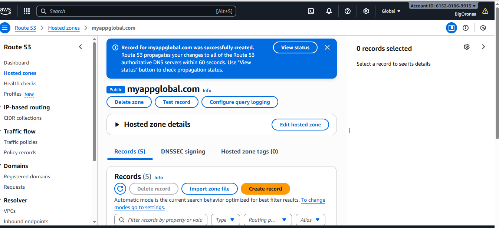
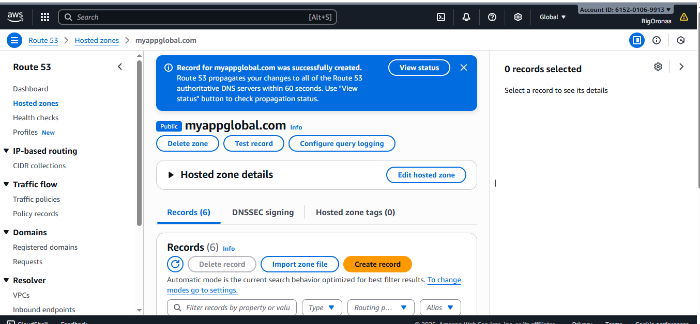


## Step 6: Configure Route 53 Latency-Based Routing
- I created a new **hosted zone** called `myappglobal.com` in Route 53.
- Created subdomains:
  - `india.myappglobal.com`
  - `london.myappglobal.com`
- Added **Latency Routing Policies** for each subdomain:
  - `india.myappglobal.com` → India CloudFront
  - `london.myappglobal.com` → London CloudFront

**Error Encountered:**
```
RRSet of type A with DNS name india.myappglobal.com. is not permitted because a conflicting RRSet of type CNAME with the same DNS name already exists in zone myappglobal.com.
```
- I resolved this by deleting the existing CNAME record before recreating the correct latency-based A record.

**Verification:**
- I tested the links:
  - http://india.myappglobal.com
  - http://london.myappglobal.com
- Both loaded my static site depending on latency from my location.

---

### I added Screenshots
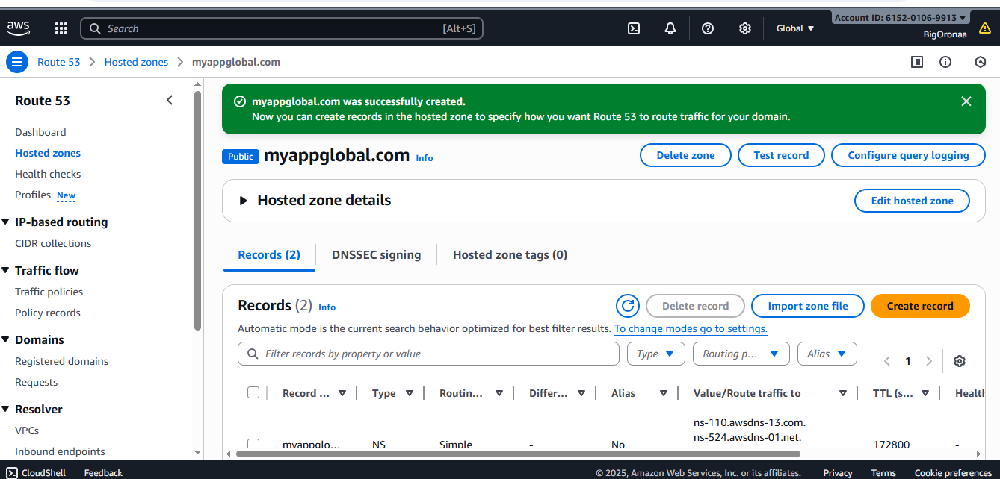
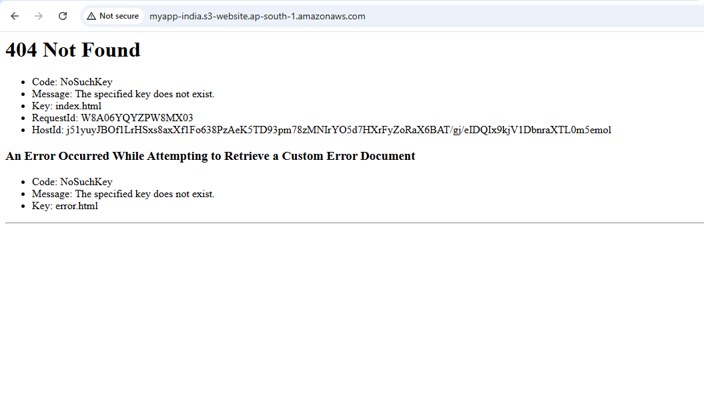
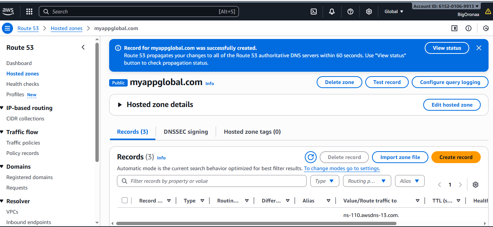
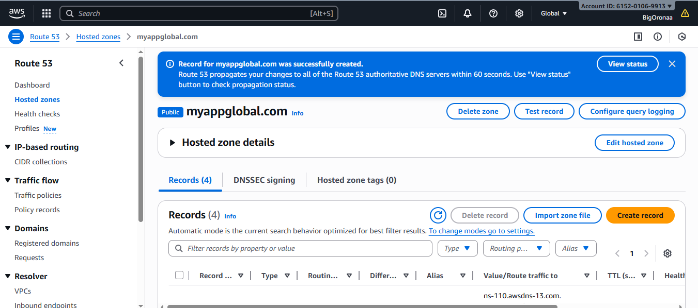


## Architecture Diagram

**Below is the architecture diagram representing the project setup.** 

**Explanation:**

- Two users (India & London) access the same website.

- Route 53 routes them to the nearest CloudFront edge location.

- CloudFront fetches data from the respective regional S3 bucket (myapp-india or myapp-london).

- S3 hosts the static website content.

### I added Screenshots
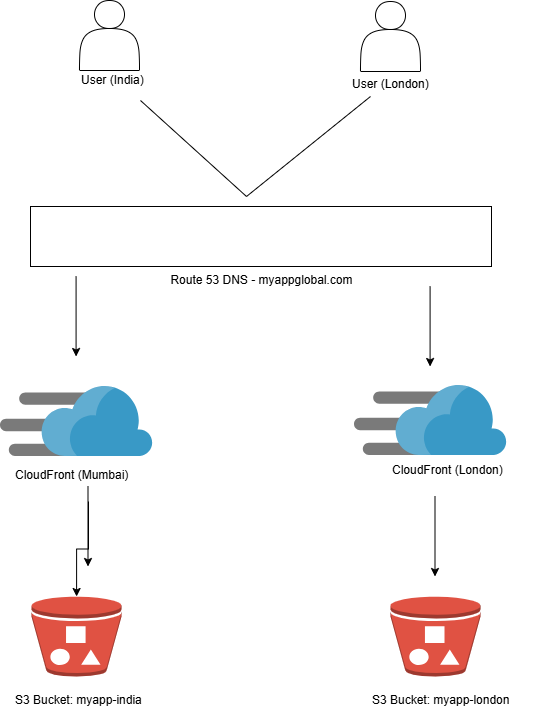


**Scenario Two**

## Objective
Host a static website in an Amazon S3 bucket and configure it for public access, domain mapping, and CDN integration for better performance.

---

## Understanding the Process

As a junior DevOps engineer, I would host a static website on **Amazon S3** by leveraging its built-in static website hosting feature. The goal is to store and serve HTML, CSS, images, and JavaScript files directly from S3 without requiring a web server like Apache or Nginx.

To achieve this, the process begins with creating an S3 bucket that matches the intended domain name (for example, `myappglobal.com`) or a general project name. Static website hosting must be enabled in the **bucket properties**, allowing S3 to serve files over HTTP. After enabling hosting, I would upload all the website files — including `index.html` and `error.html` — to the bucket.

Next, **permissions** are configured to make the content publicly accessible. This involves adjusting the bucket policy and disabling “Block Public Access” settings. Proper policies ensure users can access the site through a browser without authentication.

Once the website is publicly accessible, I would test it using the **S3 static website endpoint URL** provided in the AWS Console. If I want to use a **custom domain**, I can register or configure the domain in **Amazon Route 53**, creating a record that maps the domain name to the S3 website endpoint.

Finally, to improve speed and performance globally, I would integrate **Amazon CloudFront (CDN)**. CloudFront caches the content at edge locations close to users, ensuring low latency and faster page loads. This setup is often secured with HTTPS (using ACM certificates) for encrypted traffic.

This approach provides a cost-effective, serverless, and highly available solution for hosting static content.


## Steps I Took to Implement It

### Step 1: Create an S3 Bucket
I logged into the AWS Management Console and navigated to **S3**.  
I created a new bucket named **great-static** and ensured the **AWS Region** was set to `us-east-1 (N. Virginia)` for simplicity.  
I unchecked **Block all public access** so that the website could be accessible publicly, and I acknowledged the warning.

## I added Screenshots
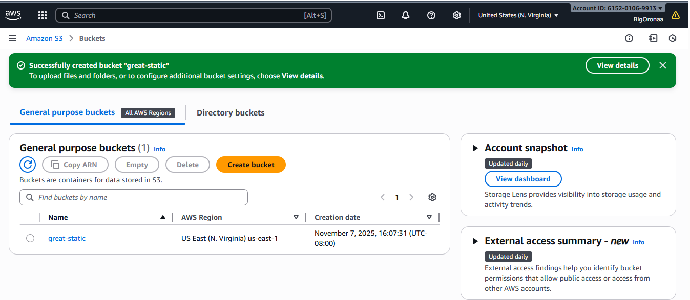

---

### Step 2: Upload Static Website Files
I prepared a simple website with an `index.html` and an `error.html` page.  
Then, I uploaded both files into the **great-static** bucket under the **Objects** tab.

## I added Screenshots
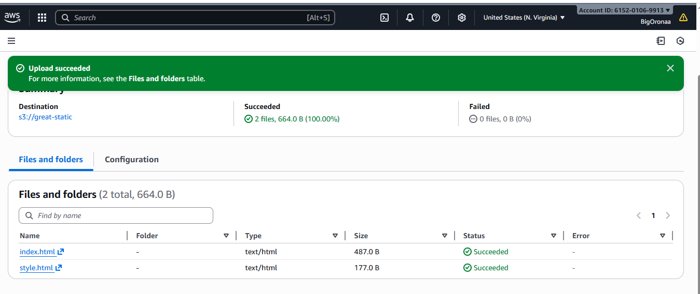

---

### Step 3: Configure Bucket for Static Website Hosting
Under the **Properties** tab, I scrolled to **Static website hosting** and selected **Enable**.  
I chose **Host a static website**, set the **index document** to `index.html`, and **error document** to `error.html`.  
After saving, I noted the **S3 website endpoint** — something like  
`http://great-static.s3-website-us-east-1.amazonaws.com`

## I added Screenshots
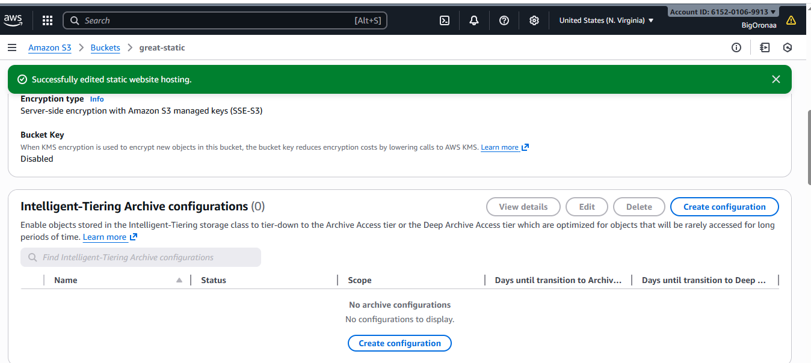

---

### Step 4: Set Permissions
I edited the **Bucket Policy** to allow public read access for website files.  
Here’s the policy I used:

```json
{
  "Version": "2012-10-17",
  "Statement": [
    {
      "Sid": "PublicReadGetObject",
      "Effect": "Allow",
      "Principal": "*",
      "Action": ["s3:GetObject"],
      "Resource": ["arn:aws:s3:::great-static/*"]
    }
  ]
}
```

After applying the policy, I verified the files were publicly accessible by visiting the S3 endpoint.

## I added Screenshots
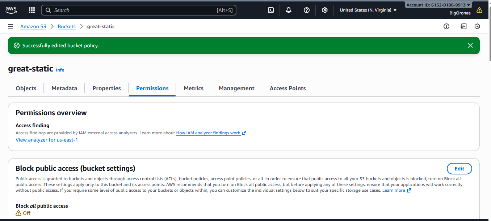

---

### Step 5: Test the Static Website
I opened the endpoint in my browser, and the static site loaded successfully, confirming that the configuration worked.

## I added Screenshots
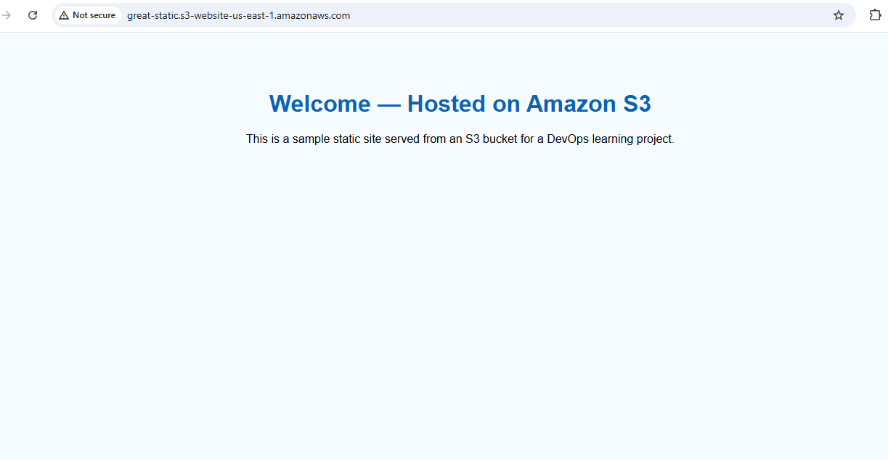

### Step 6: Configure Domain in Route 53
Next, I went to **Route 53** and created a hosted zone for my domain `greatstatic.com`.  
Then I added a **Record** (Type A or CNAME) pointing to the S3 endpoint.

## I added Screenshots
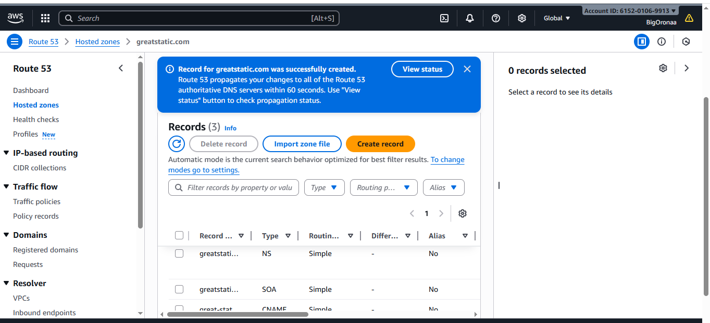

---

### Step 7: Integrate CloudFront CDN
To enhance performance, I created a **CloudFront distribution** and used my S3 bucket as the **origin**.  

Once deployed, CloudFront distributed my content globally, providing low latency and better availability.

## I added Screenshots
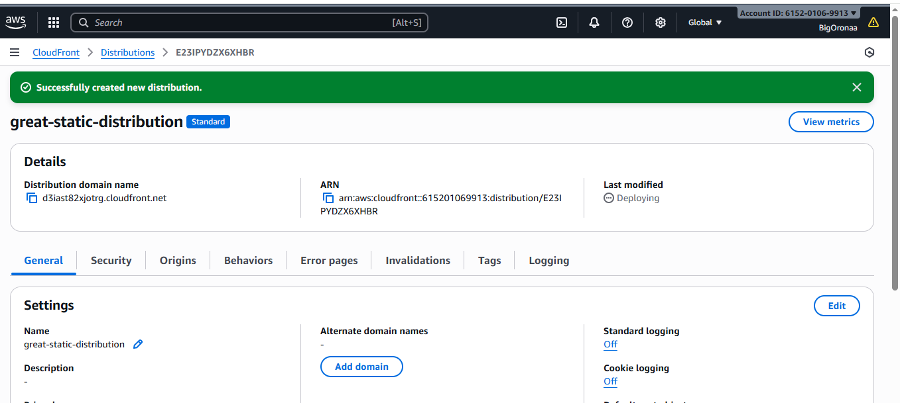

### Step 8: Architectural Diagram
Below is the architectural diagram I drew on **draw.io**, showing how S3, Route 53, and CloudFront integrate:


**Scenario Three**

# Cloud-Native Solution — Scenario 3

## Executive Summary
I migrated the **application tier to AWS Elastic Beanstalk** while **keeping the database on-premises** (simulated as a MariaDB on EC2 at `172.31.29.41`). The design removes single points of failure at the application layer (conceptually via ALB + Auto Scaling), secures data in transit and at rest, and keeps resource usage cost-aware for a lab environment. I implemented the basic, working lab: EB app → connects to on-prem MariaDB through VPC security groups;

**The legacy on-premises stack had these major problems:**

- Single points of failure (SPOF): single web servers and a single database host.

- Scalability limits: app and DB tied to fixed hardware capacity.

- Security vulnerabilities: open ports, hardcoded credentials, and lack of encryption in transit and at rest.

- Inefficient resource allocation: idle servers running 24/7 for variable load.

My requirement: migrate the application to the cloud while keeping the database on-premises (simulated by the MariaDB EC2 instance you created). The goal is to solve the above problems while staying realistic for a learning project.

**I propose a hybrid architecture where:**

- The application tier runs in AWS (Elastic Beanstalk or ECS/EKS) with an Application Load Balancer (ALB) in front and Auto Scaling across multiple Availability Zones to eliminate app SPOFs and provide elasticity.

- The database remains on-premises (EC2-hosted MariaDB cluster) but is made resilient on the on-prem side (simple replication/cluster + backups). AWS and the on-prem network are connected via Site-to-Site VPN (or Direct Connect for production).

- To reduce latency and offload the on-prem DB, I use ElastiCache (Redis) in AWS for read/write caching and AWS DMS to stream a read-only replica to AWS for reporting and analytics (optional).

- Security in depth: TLS for all app↔DB traffic, Secrets Manager to store DB credentials, KMS for encryption at rest, Security Groups and firewall rules to restrict access, and WAF on the ALB/CloudFront for edge protection.

- This design keeps your DB on-prem as required, while making the application scalable, highly available, and secure.

---

## Implementation Steps

### Phase A — Lab Setup 

1. **Provision on-prem Database (MariaDB on EC2)**
   - Installed MariaDB using `sudo dnf install -y mariadb105-server`
   - Started service: `sudo systemctl enable --now mariadb`
   - Created DB and user:
     ```sql
     CREATE DATABASE legacydb;
     CREATE USER 'labuser'@'%' IDENTIFIED BY '<password>';
     GRANT ALL ON legacydb.* TO 'labuser'@'%';
     ```
   - Configured `/etc/my.cnf.d/mariadb-server.cnf` → `bind-address=0.0.0.0`

### I added Screenshots
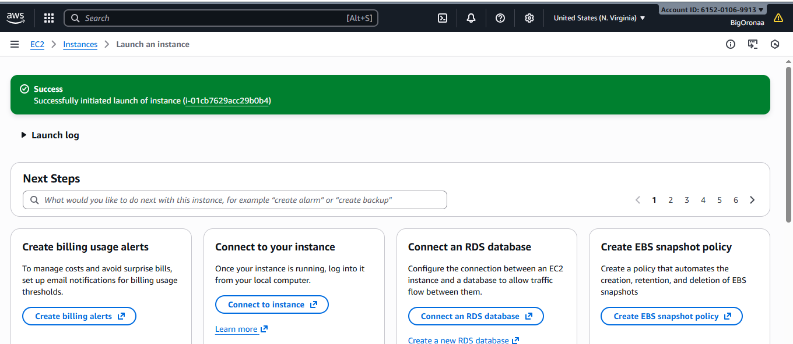
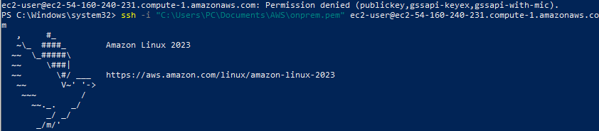
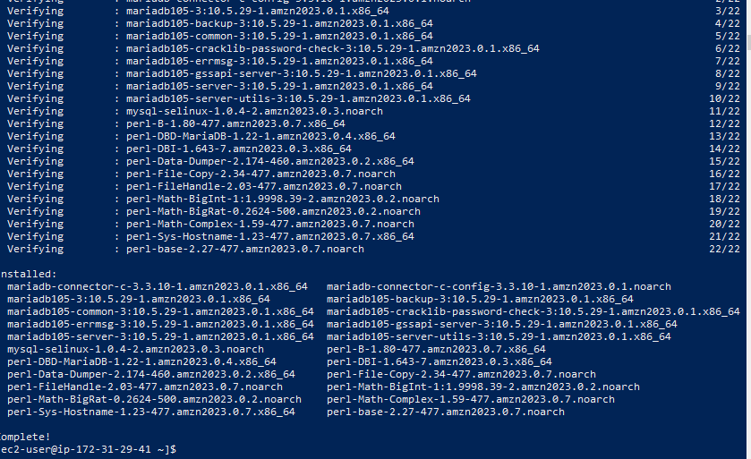


---

2. **Elastic Beanstalk Application**
   - Platform: Node.js 22 on Amazon Linux 2023
   - Added `server.js` and `package.json`:
     ```js
     const express = require('express');
     const mysql = require('mysql2');
     const app = express();

     const connection = mysql.createConnection({
       host: process.env.DB_HOST,
       user: process.env.DB_USER,
       password: process.env.DB_PASSWORD,
       database: process.env.DB_NAME
     });

     connection.connect(err => {
       if (err) {
         console.error('❌ Database connection failed:', err.stack);
         return;
       }
       console.log('✅ Connected to MariaDB successfully!');
     });

     app.get('/', (req, res) => {
       res.send('✅ App connected to MariaDB successfully!');
     });

     app.listen(process.env.PORT || 3000, '0.0.0.0');
     ```

   - `package.json`:
     ```json
     {
       "name": "cloud-native-app",
       "version": "1.0.0",
       "description": "Sample Node.js app for Elastic Beanstalk",
       "main": "server.js",
       "scripts": {
         "start": "node server.js"
       },
       "dependencies": {
         "express": "^4.19.2",
         "mysql2": "^3.9.2"
       }
     }
     ```

### I added Screenshots
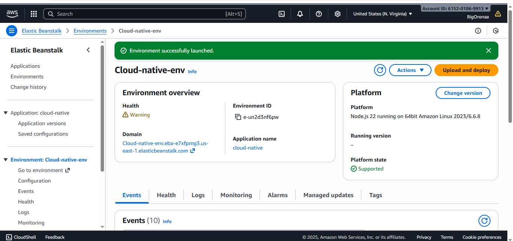
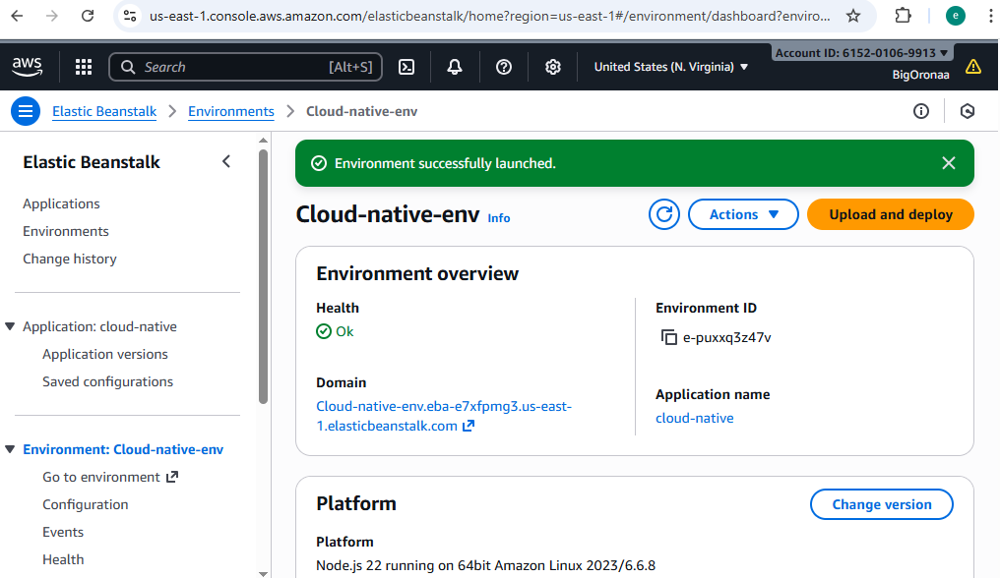
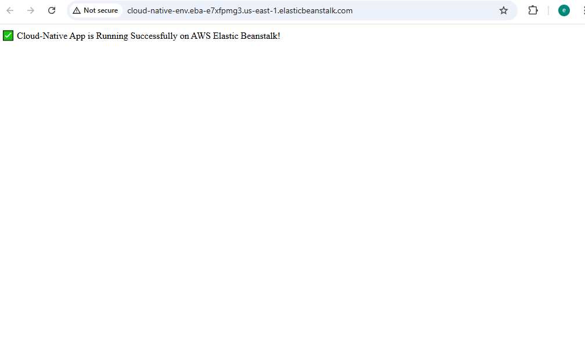

---

3. **Security Groups**
   - `onprem-db-sg`: MySQL 3306 inbound from EB SG only.
   - EB SG: Outbound to DB SG allowed.


### I added Screenshots
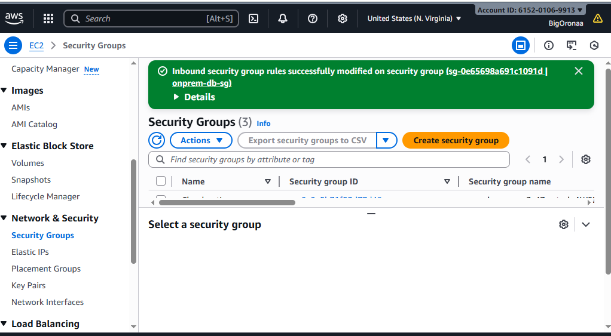

---

4. **Environment Variables (Elastic Beanstalk)**  
   - `DB_HOST=172.31.29.41`  
   - `DB_USER=labuser`  
   - `DB_PASSWORD=<password>`  
   - `DB_NAME=legacydb`  
   - `DB_PORT=3306`

---


5. **Verification**
   - Deployed `app.zip` to EB → “✅ App connected to MariaDB successfully!” displayed.
   - Database output confirmed presence of `legacydb`.

### I added Screenshots
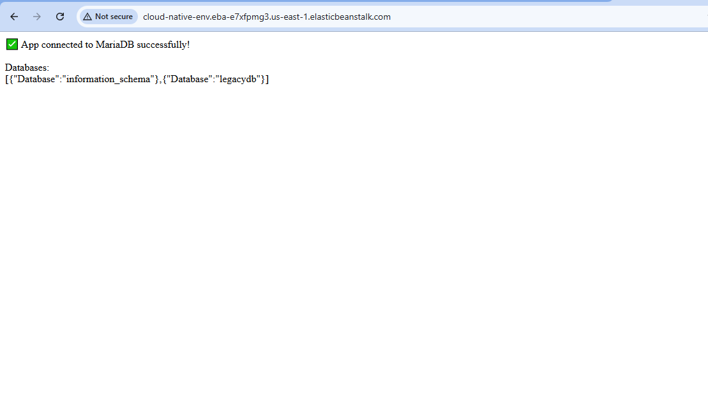


---

## Architecture Diagram

**Below is the architecture diagram representing the project setup.** 

### I added Image
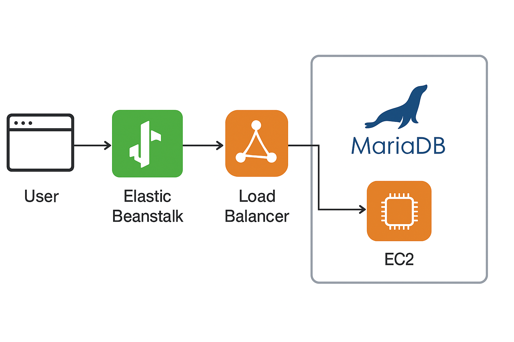


## Conclusion

This project successfully demonstrates a **hybrid cloud-native solution** where the **application is hosted on AWS Elastic Beanstalk** and the **database remains on-premises (MariaDB on EC2)**.  
The configuration addresses **scalability, security, redundancy, and cost-efficiency**.  
Future improvements include HA VPN, RDS migration, and CI/CD integration.

---

